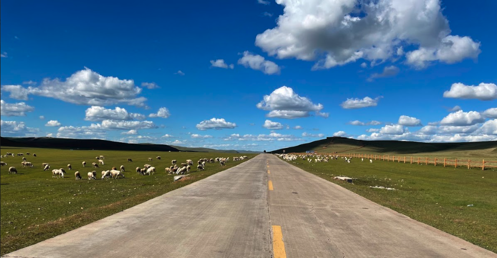

# 大料在路上

*自传体小说·纪实*

---

## 第一章：考证

当年在北京开出租车不是有驾照就行的事。驾驶证是必须的，但光有驾照不够——还要北京身份证，还要去驾校报名，上课，考试，拿证。

不是普通的驾校——是专门做出租车从业资格培训的驾校。报名的时候看身份证、看驾驶证，填登记表，缴费。然后上课，主要上两门课：北京交通地理和出租车服务规范。

身份证是门槛，但不是什么了不起的门槛——不是铁饭碗，顶多算个铁碗饭。有北京身份证的人很多，愿意干这行的不多。这碗饭有点技术含量，但主要靠两样东西：时间和体力。你把时间堆上去，把体力搭进去，收入就跟得上来。不用学历，不用背景，不用关系——出租车可能是北京城里最接近"按劳分配"的行业了。

交通地理课讲的是你认不认路。北京城多大？二环三环四环五环六环，胡同大街高架桥，哪个路口能掉头哪个不能，哪个小区从哪个门进最方便——你得全装在脑子里。那两年还没有手机导航，后来有了也不太敢信——导航带你走的小路有时候比你自己绕的还远。乘客上了车说一个地名，你得两秒之内想出来走哪条路最快，哪个时段哪段路堵，哪个红灯长哪个红灯短。这不是背出来的，是跑出来的。

服务规范课考的是另一套——你怎么开门，怎么搬行李，怎么跟乘客说话，怎么处理投诉。听起来简单，做起来全是细节。考试要笔试加实操，都通过了才发证。

但真正考不出来的，是沟通交流的能力。出租车是个密封的小空间，乘客上车坐你后面，四目不相对，但嘴是张着的。有的人一上车就开始说，跟你说他的工作、他的烦心事、他的家庭、他对这个国家的看法——你说不说不重要，重要的是你会不会听。会听的司机，乘客下车时心情比上车时好；不会听的，乘客下车时比上车时更烦。

这门功夫考不出来，只能在路上学。

考试通过了，发一张出租车司机合格证书。拿着这张证书，就可以去出租车公司找工作了。

---

## 第二章：接车

考完证不是去上班——出租车公司不是写字楼，你不用每天去坐在那里。你要做的是去问：有没有车开？

双班车比较好找。一辆车两个人倒班，白班夜班轮着来，人停车不停，公司多挣钱，两个司机各挣各的。但双班有个问题——你得找好对班的人。这个人决定了你每天交接车的体验，也间接决定了车的状况。他猛踩油门你不心疼？他撞了刮了你修？他交接的时候车干不干净？对班找不好，比娶错人还麻烦。

单班车不好找。公司当然希望人停车不停——车在路上跑，公司收的"车份"才最大化。单班一个人开一辆车，车每天有一半时间停在车场里吃灰，公司少挣一份。所以单班车通常是旧车，新车都留给双班——双班的车磨损快，但收入也快，新车跑双班性价比最高。

我要单班，原因只有一个：接送孩子。

但接送孩子只是直接原因，不是全部原因。

开出租车之前我做过工程师、程序员、自由职业者——就是现在说的灵活就业。最高做到过技术总监。技术总监听着体面，但职业这条路走到一定位置之后，往上走靠的不是技术，是政治——公司政治、人际政治、站队政治。我不是不会，是不想。

自由职业做了几年，接项目、做咨询、写代码。自由是自由了，但收入不稳定，而且自由职业最大的敌人不是没活干，是一个人太孤独——你一个人在家写代码，跟一台机器说话，说了三天就想去街上找活人说说话。

2012年，孩子上初中，每天要接送。我需要一个不限号、时间灵活、能接触人的活。出租车刚好满足这三条：不限号、自己安排时间、每天跟不同的乘客说话。

有人问我为什么开出租车——你一个技术总监去开出租车，不浪费吗？

不浪费。我开出租车不是为了谋生，是为了认识社会。我想知道这个城市里除了写字楼和格子间之外的人是怎么活的。工程师眼里看到的是系统，出租车司机眼里看到的是人。我想看人。

而且我想体验一下"骆驼祥子"——老舍写的是1930年代的人力车夫，我开的是2010年代的出租车。八十年过去了，拉车的从人变成了机器，但拉车的人还是同一种人——靠体力在城市里讨生活的人。祥子是被动拉车的，我是主动的。但主动也好被动也好，方向盘一握上，路就是你的了。

出租车不限号，这是我选这行的现实理由之一。北京的限号摇号政策2011年开始，到2012年已经掐死了很多人买车的念头。但出租车不限号——每天都能开，每天都能接送孩子上下学。单班的好处是我自己决定什么时候出车、什么时候收车。送完孩子直接拉活，接孩子之前收车，不用跟对班抢时间。

代价是"车份"——月租费比双班高。单班一个人扛一份车份，双班两个人分摊。我多付的那部分，买的不是车，是自由。

---

接车那天阳光灿烂。公司位于南四环肖村桥附近，我先坐十号线地铁到肖村站，出来走路过南四环的肖村桥，到了渔阳出租车公司的停车场。

车是旧车，但刚整备完，洗了打了蜡，内饰换了一套座套，看着还算可以。但你知道这是面子活——公里数摆在那里，这车之前跑过多少个日夜，从谁的手里过来的，你不知道。估计是双班淘汰下来的：跑够了，旧了，双班不要了，公司整备一下给单班。

旧车有旧车的脾气。发动机的声音、方向盘的虚位、刹车的软硬——这些都是上一个司机留下的痕迹。

队长把车交给我，钥匙、行驶证、计价器卡，一样一样点清。签完字队长回办公室了。院子里的其他司机看了我一眼——又来一个新人，他们见多了。

我站在车旁边看了看。这辆车以后跟我的名字绑在一起——车牌号、营运证、计价器编号，全是我的。虽然是辆旧的，但它是我的。

坐进去，调好座椅和后视镜，钥匙一拧，发动机响了。这个声音以后要陪我两年。

开出院子向北走。出了公司大门那一下方向盘比想象的沉——旧车的助力转向没有新车那么轻，而且出租车的方向盘比私家车重，你得多用一点力气。但这一点点力气让你意识到：你开的不是自己的车，你开的是一辆要载人的车。

---

## 第三章：开壶

进了四环就有人招手。打车的是个白领，要去国贸。

我跟他实话实说："刚接的车，路不太熟。"

他倒不急："没事，我指你开。"

"我指你开"四个字，比什么都管用。有人指路比看导航强——导航告诉你怎么走，乘客告诉你他想怎么走，这两件事不是一回事。

小心翼翼按他的指令开：向北到三环，右拐进辅路，再进主路继续向北。三环的流量不小，但出租车在这种车流里反而自在——你不需要快，你需要稳。乘客坐在后面，你急了他比你更急。

快到国贸之前出来走辅路，按他的指令拐到一栋办公楼下。他下车前要发票——出租车发票是很多白领报销的凭证，这一单钱不多，但发票得给。我把零钱和发票一起递过去，说了声谢谢。

他没说什么，关了门走了。白领打车就是这样——上车看手机，下车拿发票，中间不说话的多。但也有愿意说话的，尤其是下雨天或者堵车的时候，手机看腻了就开始跟司机聊。

这是我的第一个乘客。他不知道，我也没跟他说。一个白领上了辆出租车去国贸，在他看来这就是一次普通的打车——他不会想到这辆车的司机今天第一天上路，他更不会想到这个司机是专门为了接送孩子才来开出租车的。他的指令很清楚，他的语气不急不慢，他的小费是零。但他帮了我——在我手忙脚乱的第一单里，"我指你开"四个字比什么都管用。

计价器归零，我又是一个人在东三环上跑了。但这次不一样了——我拉过一个人了，收过一次钱了，给过一次发票了。出租车司机的第一天，就从一个"谢谢"开始。

---

## 第四章：小费

没多久就拉了第二个乘客——一个老太太，上车就笑。

"师傅，我跟您说——"她一上车就开口了，语气里带着一股藏不住的高兴。

"我儿媳妇生了！大孙子！七斤六两！"

她说这话的时候整个人是亮的。不是那种客套的亮，是真亮——从心里往外亮的那种。她刚从医院出来，脸上还带着没散的喜气，坐在我这辆旧出租车里，像是坐在花轿里一样高兴。

我回头看了一眼，笑着说："恭喜恭喜！大喜事！"

她更高兴了，开始跟我讲：儿媳妇怀的时候多辛苦，预产期过了三天才发动，她一夜没睡在医院等着，听到孩子哭的时候腿都软了。我一边开车一边听，该搭腔的时候搭两句，不该插嘴的时候就安静听着。老太太不需要你说什么，她需要有人听她说——这种高兴是装不住的，必须找人倒出来，不然要憋坏。

到了地方，计价器显示金额，她掏出钱来递给我，摆摆手说不用找了。

我愣了一下。在北京开出租车，小费这事是很少见的。中国人没有给小费的习惯——该多少多少，一分不多一分不少。给小费的通常是外国人，尤其是北美来的。后来我拉到过一个家边上的加拿大外教，每次约到我的车都会给小费，那是人家的文化。但一个北京老太太给小费，我那两年就遇到这一回。

她不是在付小费，她是在分享高兴。孙子来了，她高兴得不知道怎么表达，多给几块钱不是因为服务好，是因为这个世界今天对她太好了，她想对这个世界也好一点。

我收了钱，说了声谢谢，目送她走进小区门口。计价器归零，我又是一个人在路上。

但这一次心里是暖的。开出租车第一天，第一个乘客教我指路，第二个乘客教我一个道理：有时候小费不是钱，是快乐溢出来了。

---

## 第五章：大活

出租车司机有句话叫"大活"——就是远路、长途，一跑几十公里的活。大活是司机最愿意拉的。

去机场是大活里的大活。不仅是路远钱多，到了机场还能歇一会儿——甚至歇几个小时。机场有个好处：它是一个天然的蓄水池，有飞机落地就有客人出港，有客人出港就有活接。你拉一趟去机场，歇一歇，再拉一趟从机场回来，来回都是大活，中间还能上个厕所喝口水抽根烟。这一天只要碰到一个机场活，心里就踏实了。

但大活也有累的。

那天先送人去南苑机场。南苑机场在丰台，跟首都机场比小得多，主要跑一些短途航线和通用航空。从城里去南苑不算远，但那片路况一般，大车多，红绿灯也多。送完人，正准备歇一口气，计价器一归零，又有人上车了——去房山王佐镇。

王佐镇在北京西南，从南苑过去不算近，一路往南开，越开越偏，城市的密度在身后一点一点变薄——高楼变矮房，马路变乡道，红绿灯变十字路口。到了王佐镇，以为这趟该歇了，结果又上来一位——去首都机场。

首都机场在东北，王佐镇在西南，这等于从北京的一个角穿到另一个角。一个对角线的大活。

但这算是个大活。累并快乐着。

为什么快乐？因为这天的大活一个接一个，收入在往上走。为什么累？因为从南苑到王佐到首都机场，这一路跑下来小一百公里，屁股坐麻了，腰也硬了，眼睛盯着路面盯到发干。大活的好处是路远钱多，坏处也是路远——你跑得越远，回来的路也越远。如果最后一个客人把你拉到了城市的另一头，收车的时候你还得空车跑回来。

不过那天还好——首都机场是最后一站，到了机场就是回到了"蓄水池"，歇一会儿，再拉一个大活回家。这天的大活像糖葫芦一样串在一起，虽然累，但收车的时候算一算，收入比平时多一截。

---

## 第六章：堵车

很多乘客以为出租车司机喜欢堵车——计价器在跳嘛，堵一分钟跳一块钱，坐着不动就挣钱，多好。

这是外行话。

出租车也叫计程车——重点在"程"不在"时"。收入的大头是里程费，不是时间费。跑得快，里程数上得快，收费才多。堵车时那点计时费，一分钟几毛钱，连油钱都不够——发动机怠速烧的油、磨损的零部件、你搭进去的时间，这些成本远比计价器上跳的那几毛多。

堵车是出租车司机的噩梦。你坐在车里不动，计价器跳得很慢，但成本在跑——油在烧、时间在流、下一个活接不到。一个通畅的下午能拉八九单，一个堵车的下午可能只拉三四单，收入差一倍。堵车时收的那点计时费，连弥补这个差额的零头都不够。

而且堵车的时候乘客心情不好。他坐在后面看表，你坐在前面也看表——他看的是他还剩多少时间，你看的是这单还要耗多久。两个人都急，但急的方向不同：他急的是快到，你急的是快走。堵车的时候车里气氛比外面的路况还闷。

所以出租车司机最怕的不是路远，是路堵。路远是体力的活，堵车是心理的活。跑一百公里你不怕，堵一百分钟你受不了。

北京的堵是有规律的——早高峰东进西出，晚高峰西进东出，三环永远比四环堵，四环永远比五环堵。老司机不是记路的人，是记路况的人——哪段路几点开始堵、堵多久、怎么绕，这些比交通地理考试难多了。

---

## 第七章：手机

2013年，滴滴出来了。

嘀嘀打车——那时候还叫这个名字——刚出来的时候，对出租车司机是好事。平台不收信息费，一分钱不要，白用。不仅如此，用户和平台还经常发红包，乘客用App叫车有补贴，司机接单也有补贴。等于出租车司机帮平台做推广，平台拿钱砸市场，司机跟着喝汤。

我经常抢单抢红包。手机架在仪表台上，有空就刷一下，看附近有没有单子。抢单跟抢出租车公司里的双班车位不一样——抢单是公平的，谁手快谁接到，不看出身不看关系，看手机信号和手指速度。

那段时间的打车App像一阵风——来得快，变脸也快。嘀嘀和快的两家打得头破血流，今天你补贴五块，明天我补贴十块，后天两家合并了。补贴少了，信息费来了，司机的好处一点点被拿走。但2013年那会儿是蜜月期，平台对司机好得不像话——因为那时候司机是稀缺资源，乘客要用车，没司机接单平台就活不下去。

不过打车App始终不是我的主线。出租车是谋生，炒股才是。

其实我一直在炒股票。做出租车司机之前就炒，开出租车期间有空也看。堵车的时候别人看路况，我看行情——红灯停下来，掏出手机扫一眼K线，绿灯亮了放下手机踩油门。红灯一个接一个，行情也一眼一眼地看。北京的红灯够多，够我把当天的盘面看完。

出租车和股票，一个是体力活一个是脑力活，一个是白天干一个是晚上想。白天跑路赚钱交车份，晚上研究K线想怎么让钱生钱。两个活加在一起，身体累但脑子不闲——我觉得这比纯开车好，脑子不闲着，人就不闷。

后来有人问我：你一个技术总监去开出租车，是不是屈才？我说不是——出租车是我的社会调查，股票是我的理财课堂，两个加在一起，比坐办公室学到的多。

---

## 第八章：顶灯

2015年春节，我不开出租车已经一年了。但出租车教给我的东西还在。

那年家里租了辆新车，自驾去河南陕西。孩子学了几年中国历史，想看看秦汉唐宋的都城长什么样。第一站开封。

沿着京开高速一路往南，到河北就开始有雾霾。2015年的雾霾比2012年更重——那两年华北的冬天，空气是灰黄色的，能见度低到高速都不敢开。到河南境内，高速封了，只能下高速走国道。

国道比高速慢得多，而且天已经黑了。雾霾加上夜色，能见度更差——前方几十米外的路就看不清了。手机导航也快没电了，屏幕一暗一暗的，像是在提醒你：我快不行了，你自己看着办吧。

导航一死，你就从"跟着地图走"变成了"跟着感觉走"。但雾霾天的夜里，感觉也不可靠——路标看不清，岔道分不明，前方只有灰蒙蒙的一片。

这时候我看见前面有一辆车，顶灯亮着。

出租车。

我的第一个反应不是"跟着它"——是"我认识那个灯"。开了两年出租车，顶灯是我最熟悉的东西。它不只是照明，它是标志——这辆车是营运的，它有路线，它有目的地，它知道自己在往哪走。

而且我知道一件事：出租车进城才能拉到乘客。不管它从哪来，它最终要去的地方一定是城里。我跟着它走，错不了。

于是我跟在那辆出租车的后面，保持一个能看见顶灯的距离。它走我走，它停我停，它拐我拐。顶灯在雾霾里像一盏小灯笼，不亮但稳——它不会消失，因为出租车不会无故熄灯。

就这样跟着开了一段，路渐渐宽了，灯渐渐多了，楼渐渐高了——进城了。开封到了。

在路边找到一个宾馆，停好车，一家人下车。那辆出租车不知道什么时候就拐走了——它去了它该去的地方，我去了我该去的地方。它不知道后面跟了一辆私家车，靠它的顶灯走了二十几公里夜路。它也不知道跟在后面的那个人，也开过两年出租车。

2012到2014年，我开出租车。2015年，出租车带我进了开封。

顶灯这东西，开的时候是你的招牌，不开的时候是别人的路标。你以为你离开了出租车，出租车就没离开你。

---

## 第九章：小夜班

夜班我跑过，但只跑过小夜班——最多跑到深夜，或者凌晨早起接客人去机场。通宵没跑过。

通宵是另一种活。大夜班的客人跟白天的客人不是一类人——夜场出来的人，有醉酒的，有寻欢作乐的，有陪酒陪唱的。半夜三点在路上跑，乘客少，风险高，路上空旷但不安心——你不知道路边晃出来的人是过马路还是拦车还是别的什么。大夜班的司机挣的是辛苦钱加胆量钱。

我不跑大夜班，接送孩子是第一位的，身体也扛不住。但小夜班跑得不少。

小夜班的客人比白天单纯——主要是两种人：逛夜市的和加班的打工人。

逛夜市的是休闲的人。晚上九十点钟从三里屯、簋街、后海出来，打车回家，身上带着饭味酒味烟味，心情不错，话也多一些。这种人好拉——上车高兴，下车痛快，偶尔还会聊两句今晚吃了什么去了哪。

加班的打工人是另一种。从写字楼里出来，西装领带，脸色灰白，上车就靠在座椅上闭眼，说一个地址就不说话了。国贸、金融街、中关村——这些地方的写字楼夜里十点还亮着灯，亮着灯的每扇窗户里都有人。他们打车不是因为舒服，是因为地铁停了、公交没了、自己又累得走不动路。这种人上车不看手机不说话，有时候到了地方都叫不醒。

小夜班的好处是路不堵——晚上十点以后的北京，三环能跑到六十迈，这种速度感是白天没有的。坏处是活少——街上人少了，招手的也少了，有时候跑好几公里空车才接到一个。

---

有一次从歌厅拉了一个人。

他上车的时候还算清醒——能说出自己家住哪，口齿虽然有点含糊但意思到了。是那种"还没醉倒但已经在路上了"的状态。

开了一段时间，后面没声音了。我从后视镜看了一眼——他歪在座椅上，睡着了。

到了他说的那个小区门口，我叫了他两声，没反应。推了一下他的肩膀，嘟囔了几句又沉过去了。问题是进了小区我不知道该往哪走——他说了小区名字但没说几号楼几单元。小区里黑灯瞎火的，我也不敢往里开——万一开到死胡同还得倒出来。

最后我把车停在小区门口的保安亭旁边，下去问保安。保安过来看了一眼，认出来了——是小区里的住户。保安查了登记，打电话联系了他家人。

过了一会儿，他家里人下来了——是他老婆，穿着睡衣，一脸无奈的表情，显然不是第一次干这事了。她跟保安一起把人从后座上弄出来，架着胳膊往楼里扶。那个人半梦半醒的，脚在地上拖，嘴里含含糊糊说了句什么，听不清。

我站在车旁边看着他们进楼。老婆架着老公，走几步停一下，停一下再走几步。夜色里两个人的影子在路灯下拉得很长。

上车，计价器归零。他老婆下楼的时候付了钱，没多说，只说了句"谢谢师傅"。我说不客气。

其实我想说的是——你老公没事，就是喝多了。但这句话说出来又显得多余。她比谁都清楚她老公什么情况。

小夜班就是这样——你看到的都是人卸了妆以后的样子。白天光鲜的，夜里灰头土脸；白天精神抖擞的，夜里烂醉如泥；白天对着客户笑的，夜里对着老婆哭。出租车是个流动的卸妆室——乘客白天穿什么面具，夜里上了车就卸了。

---

## 第十章：收车

开出租车这件事，开头有原因，结尾也有原因。

开头是为了接送孩子。孩子上初中，每天上下学要人接送，出租车不限号，单班自己安排时间，这是最直接的解决方案。

结尾也是因为孩子。孩子初中毕业了，不用接送了——这个理由没了。

第二个理由是车。那辆旧车跟我跑了两年，该修的地方越来越多。出租车跑的公里数是私家车的好几倍，磨损快，零件老化也快。今天变速箱，明天刹车片，后天发动机灯又亮了——每次进修理厂都是一笔钱。修车的时间不出车，不出车就没有收入，但车份照交——你修车的那天是在倒贴钱。

旧车就像旧人，相处久了有感情，但感情归感情，钱归钱。到了某个点，修车的钱和耽误的时间加起来，比换一辆车还贵，你就知道该散了。

但我没换车。

不干了就不用换车了。

孩子不用接送了，车也老了，这两件事撞在一起，时间就到了。跟出租车公司退了车，交清车份，归还了计价器卡和营运证。钥匙交回去的那天，队长说了句"慢走"，我说了句"谢谢"，就这样了。

没有告别仪式，没有散伙饭，没有什么仪式感。出租车这个行业，来的时候签个字，走的时候也签个字。你开过的那辆车会被公司整备一下，换一套座套，打一层蜡，然后交给下一个新人。下一个新人坐进去，调座椅，调后视镜，拧钥匙，发动机响——跟他来之前一模一样。

两年。从第一天手忙脚乱地开壶拉的第一单去国贸，到最后一次把车开回渔阳的院子。中间拉了多少人、跑了多少路、听了多少故事、堵了多少次三环——记不清了。能记住的都是少数：给小费的老太太、指路的白领、睡着的醉汉、跟着顶灯进的开封、从南苑到王佐到首都机场的大活。

剩下的全混在一起，变成了北京城里的路——二环三环四环五环，哪条都跑过，哪条都一样。

---

## 尾声

不开出租车之后干什么？

2014年离开出租车，2015年开始专门做大料投资管理。其实股票一直在炒，开出租车期间就在看了——红灯看K线，绿灯踩油门，北京的堵车给了我足够的盘面时间。现在不用开出租车了，时间全是自己的，可以专心做投资。

后来又找了两个公司上班，做技术咨询和顾问。技术总监的底子还在，出租车司机的见识也留着——跟客户谈方案的时候，我脑子里有两套系统：一套是技术架构，一套是人情世故。前者是工程师时代学的，后者是出租车时代学的。两套加在一起，比单靠一套管用。

这些在北京奥运十八周年记里写过，不再重复。

回头看那两年——2012到2014，北京，出租车，一辆旧车，一个城市，无数个陌生人。两年不算长，但够你认识一个城市。不是从地图上认识，是从路上认识——每一条街跑过，每一个红绿灯等过，每一个乘客载过。

路的尽头还是路。但有时候，路不需要你自己认——前面有一盏顶灯就够了。

---

*2012—2014，大料在北京开出租车。两年，一辆旧车，一个城市，无数个陌生人。*

